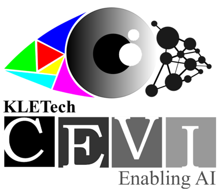

# TP-NoDe
Code for ICCVW-2023 accepted paper TP-NoDe: Topology aware Progressive Noising and Denoising of Point Clouds

### [Akash Kumbar](https://akash-kumbar.github.io/), Tejas Anvekar, Tulasi Amitha Vikrama, Ramesh Ashok Tabib, Uma Mudenagudi

<div align="left">
<a></a>
<a></a>
</div>

[[Paper]](https://openaccess.thecvf.com/content/ICCV2023W/WiCV/papers/Kumbar_TP-NoDe_Topology-Aware_Progressive_Noising_and_Denoising_of_Point_Clouds_Towards_ICCVW_2023_paper.pdf)
<br><br>


<!-- <div align="center"> 

<!-- 
We present an overview of the proposed GPr-Net framework, which processes point clouds in a few-shot episodic paradigm using the proposed IGI and Laplace vectors to generate geometric feature sets. These features are then mapped to a higher dimensional permutation invariant feature using the symmetric operation $\mathcal{A}$ and a single Multilayer Perceptron (MLP) $f_{\theta}$. The Prototypical network $f_{\theta}$, utilizes the support and query geometric embeddings $\vec{L}(\Psi(x_s))$ = $\mathcal{S}_e$ and $\vec{L}(\Psi(x_q))$ = $\mathcal{Q}_e$ to predict few-shot labels. To overcome the distribution drift challenge in Prototypical Networks, we employ the Hyperbolic Distance of Euclidean. -->


<!-- </div>
<br> --> 

## Abstract
In this paper, we propose TP-NoDe, a novel Topology-aware Progressive Noising and Denoising technique for 3D point cloud upsampling. TP-NoDe revisits the traditional method of upsampling of the point cloud  by introducing a novel perspective of adding local topological noise by incorporating a novel algorithm Density-Aware k nearest neighbour (DA-kNN) followed by denoising to map noisy perturbations to the topology of the point cloud. Unlike previous methods, we progressively upsample the point cloud, starting at a 2 X upsampling ratio and advancing to a desired ratio. TP-NoDe generates intermediate upsampling resolutions for free, obviating the need to train different models for varying upsampling ratios. TP-NoDe mitigates the need for task-specific training of upsampling networks for a specific upsampling ratio by reusing a point cloud denoising framework. We demonstrate the supremacy of our method TP-NoDe on the PU-GAN dataset and compare it with state-of-the-art upsampling methods.


## Installation

* Install the following packages

```
python==3.8.16
torch==1.13.1
CUDA==11.6
numpy==1.21.2
open3d==0.17.0
einops==0.3.2
scikit-learn==1.0.1
tqdm==4.62.3
h5py==3.6.0
torch-cluster
```
Install torch-cluster using `pip install --verbose --no-cache-dir torch-cluster` [[https://pytorch-geometric.readthedocs.io/en/1.3.2/notes/installation.html]([https://github.com/luost26/score-denoise](https://pytorch-geometric.readthedocs.io/en/1.3.2/notes/installation.html))]
Also, for denoising we use score based denoising, install their packages to run this code (please follow [score-denoise](https://github.com/luost26/score-denoise))
<!-- * Ins -->

* Compile the evaluation_code for metric calculation (optional)

To calculate the CD, HD and P2F metrics, you need to install the CGAL library (please follow the [PU-GAN](https://github.com/liruihui/PU-GAN) repo) and virtual environment of PU-GCN (please follow the [PU-GCN](https://github.com/guochengqian/PU-GCN) repo) first. And then you also need to compile the `evaluation_code` folder.
```
cd evaluation_code
bash compile.sh
```

## Data Preparation
The code intakes mesh files and random samples it to mentioned number of points in the code. So, no extra pre-processing required.  
<br>
For benchmarking we use PU-GAN dataset([train set](https://drive.google.com/open?id=13ZFDffOod_neuF3sOM0YiqNbIJEeSKdZ), [test mesh](https://drive.google.com/open?id=1BNqjidBVWP0_MUdMTeGy1wZiR6fqyGmC)) 

To run the code as is, prepare a 'data' folder like this:


```
data  
├───test
```


## Running the code

To run the code:
```bash
#The noise hyper-parameters can be changed accordingly (refer to the bash scripts)
python upSampleWithNoise.py --noising global --upsampling_factor 4 --patch_size 64 --seed_k 3 --noise_type Laplacian --save_path data/Final/Global/Laplacian/PS64/
```


## Re-Create Results and ablations
```bash
#We have broken down it to two sh files
sh run_all.sh
sh run_allExps.sh
```


## Acknowledgment

Our methodology wholly depends on score-based denoising network and we use their pre-trained weights:

[Score-based denoising of Point Clouds](https://github.com/luost26/score-denoise).


## BibTeX
Please cite our paper if it is helpful to your research:
```
@inproceedings{kumbar2023tp,
    title={TP-NoDe: Topology-Aware Progressive Noising and Denoising of Point Clouds Towards Upsampling},
    author={Kumbar, Akash and Anvekar, Tejas and Vikrama, Tulasi Amitha and Tabib, Ramesh Ashok and Mudenagudi, Uma},
    booktitle={Proceedings of the IEEE/CVF International Conference on Computer Vision},
    pages={2272--2282},
    year={2023}
}
```
